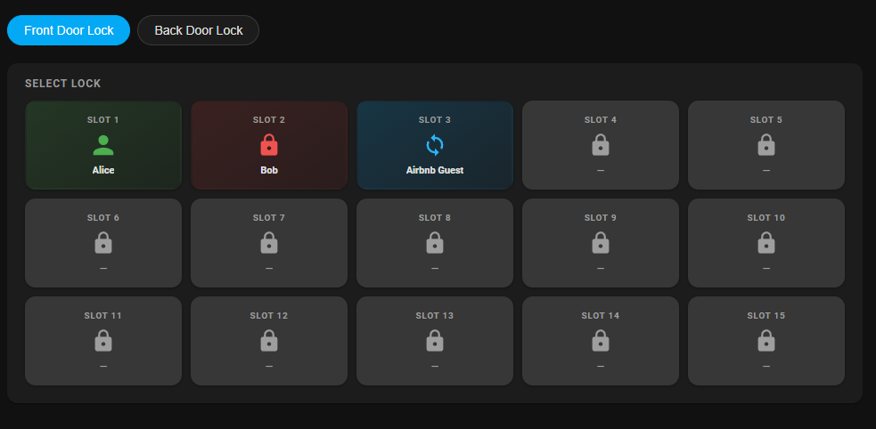
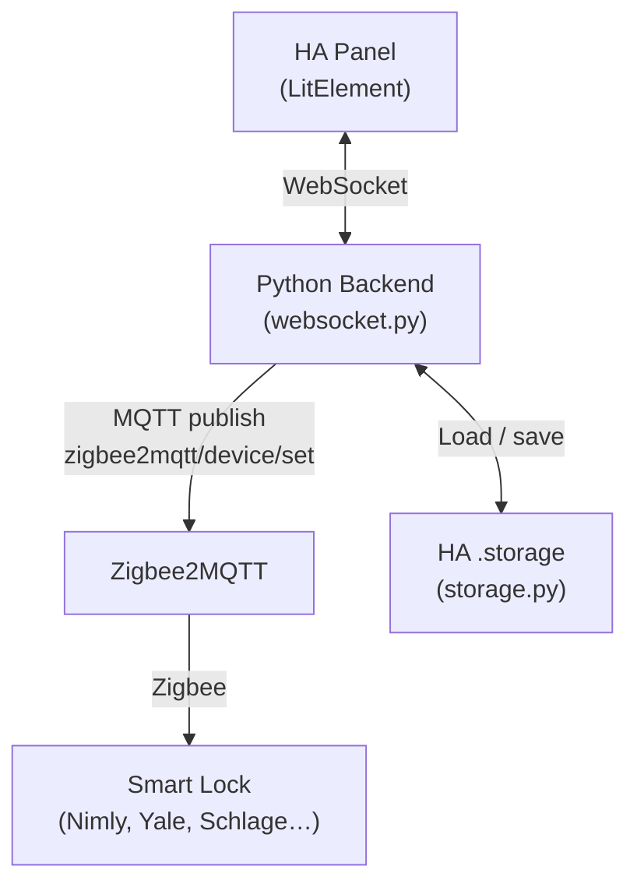
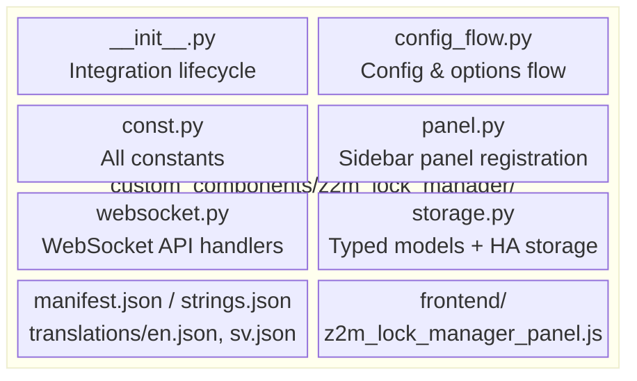

# Zigbee2MQTT Lock Manager

A [Home Assistant](https://www.home-assistant.io/) custom integration for managing PIN codes on Zigbee smart locks via [Zigbee2MQTT](https://www.zigbee2mqtt.io/).

Provides a dedicated sidebar panel to configure user code slots per lock — no YAML, no MQTT Explorer, just a clean UI.

## 

## Features

- **PIN Code Management** — Set, view, and clear user PIN codes per slot
- **Configurable Slot Count** — Define how many code slots (1–100) to manage per lock
- **Date-Based Codes** — Schedule codes to automatically enable and disable on specific dates and times
- **Auto-Rotating Guest Codes** — Generate temporary codes that auto-rotate on a schedule (e.g. every 24 h) with an expiration countdown
- **Multi-Lock Support** — Manage all your Z2M-connected locks from one panel
- **Fingerprint & RFID Tracking** — Mark which users have enrolled biometric credentials
- **User Type Control** — Set access levels: Unrestricted, Year/Day Schedule, Week/Day Schedule, or Non-Access
- **Admin-Only Access** — Panel is only visible to Home Assistant admin users
- **Multi-Language** — English 🇬🇧 and Swedish 🇸🇪 built in
- **HA Events** — Fires `z2m_lock_manager_code_rotated` events for automations

---

## Requirements

- Home Assistant **2026.3** or newer
- [Zigbee2MQTT](https://www.zigbee2mqtt.io/) installed and managing your locks
- MQTT integration configured in Home Assistant
- A compatible Zigbee lock (any lock that supports `pin_code` via Z2M). _Developed and tested on a Nimly PRO Touch (Firmware-ID 4.7.79, 20240625)._

---

## Installation

### HACS (Recommended)

1. Open HACS in Home Assistant
2. Click **⋮** → **Custom repositories**
3. Add `https://github.com/christofferward/z2m_lock_manager` as type **Integration**
4. Search for **Zigbee2MQTT Lock Manager** and install
5. Restart Home Assistant
6. Go to **Settings → Devices & Services → Add Integration**
7. Search for **Zigbee2MQTT Lock Manager**

### Manual

1. Copy the `custom_components/z2m_lock_manager` folder to your Home Assistant `custom_components` directory:
   ```
   <config>/custom_components/z2m_lock_manager/
   ```
2. Restart Home Assistant
3. Go to **Settings → Devices & Services → Add Integration**
4. Search for **Zigbee2MQTT Lock Manager**
5. Select the lock entities you want to manage and set the number of code slots, then click Submit

---

## Setup

During initial setup (and in **Settings → Devices & Services → Configure**) you can configure:

| Field                    | Description                                          |
| ------------------------ | ---------------------------------------------------- |
| **Locks**                | One or more `lock.*` entities managed by Zigbee2MQTT |
| **Number of code slots** | How many slots to display in the panel (1–100)       |

---

## Usage

After installation, a **Z2M Locks** entry appears in the Home Assistant sidebar (admin users only).

### Managing Codes

1. Select a lock from the dropdown
2. For each slot you can:
   - Set a **Name** and **PIN Code**
   - Toggle **Enabled** to activate/deactivate the code on the physical lock
   - Choose a **User Type** (Unrestricted, Schedule-based, Non-Access)
   - Mark if the user has a **Fingerprint** or **RFID** enrolled
3. Click **Save** to push the code to the lock via MQTT
4. Click **Clear** to remove the code from both the lock and the store

### Guest Codes (Auto-Rotate)

1. Check **Temporary Code (Guest)** on a slot
2. Set the **Valid for (Hours)** interval (default: 24 hours)
3. Enable the slot and click **Save**
4. A random 6-digit PIN is generated immediately and sent to the lock
5. The code auto-rotates when the interval expires
6. A `z2m_lock_manager_code_rotated` event fires on each rotation — use this in automations to notify guests of their new code

### Date-Based Codes

1. Set the **Valid From** and **Valid To** dates and times on a slot
2. Enable the slot and click **Save**
3. The integration will automatically enable the code at the start time and disable it when the end time is reached
4. The UI displays the active window and a countdown to when the code enables or disables

---

## Architecture



### Module Layout



1. The panel sends WebSocket commands to the HA backend
2. The backend publishes `pin_code` payloads to `zigbee2mqtt/<device>/set` via MQTT
3. Zigbee2MQTT forwards the command to the physical lock over Zigbee
4. Slot metadata (names, settings, rotation state) is persisted in HA's `.storage`

---

## Automation Examples

### Notify Guest of New Code

```yaml
automation:
  - alias: "Send guest code via Telegram"
    trigger:
      - platform: event
        event_type: z2m_lock_manager_code_rotated
    action:
      - service: notify.telegram
        data:
          title: "🔑 New Guest Code"
          message: >
            Your new door code for {{ trigger.event.data.name }}
            is: {{ trigger.event.data.code }}
```

---

## Roadmap

See [ROADMAP.md](ROADMAP.md) for planned features and upcoming additions.

---

## Contributing

Contributions are welcome! Please open an issue or pull request on [GitHub](https://github.com/christofferward/z2m_lock_manager).

### Development Setup

1. Clone the repository
2. Install dependencies: `npm install`
3. Run the dev server: `npm run dev` (opens a mock panel at `localhost:5173`)
4. Build for production: `npm run build` (outputs to `custom_components/z2m_lock_manager/frontend/`)

### What to Edit

| What you want to change             | File(s) to edit                                                                                   |
| ----------------------------------- | ------------------------------------------------------------------------------------------------- |
| Panel UI, layout, or styling        | `src/z2m_lock_manager_panel.ts`, `src/z2m_lock_slot.ts`, `src/styles.ts`                          |
| UI translations                     | `src/translations.ts` + `custom_components/z2m_lock_manager/translations/*.json` + `strings.json` |
| WebSocket API (add/modify commands) | `custom_components/z2m_lock_manager/websocket.py` + `const.py` (add WS type constant)             |
| Data models or storage format       | `custom_components/z2m_lock_manager/storage.py`                                                   |
| Config/options flow fields          | `custom_components/z2m_lock_manager/config_flow.py` + `strings.json` + `translations/*.json`      |
| Sidebar panel registration          | `custom_components/z2m_lock_manager/panel.py`                                                     |
| Integration setup / teardown        | `custom_components/z2m_lock_manager/__init__.py`                                                  |
| String constants (URLs, keys)       | `custom_components/z2m_lock_manager/const.py`                                                     |

> [!TIP]
> After editing any Python file, copy `custom_components/z2m_lock_manager/` to your HA `config/custom_components/` and restart Home Assistant to test. After editing TypeScript files, run `npm run build` first.

---

## Credits & Transparency

- **AI Collaboration** — The dashboard UI and some of its styling were developed with the assistance of AI (Google Antigravity), ensuring a modern and responsive experience while the project maintainer focused on the core Zigbee/MQTT logic.

---

## Disclaimer

This integration is provided **as-is**, without warranty of any kind. The authors and contributors take **no responsibility** for any data loss, security breaches, lock malfunctions, or other damages resulting from the use of this software. Use it at your own risk.

> [!CAUTION]
> This integration sends PIN codes over MQTT and stores them locally. Ensure your MQTT broker is properly secured. Always verify that codes work as expected on the physical lock before relying on them.

---

## License

This project is open source. See the repository for license details.
